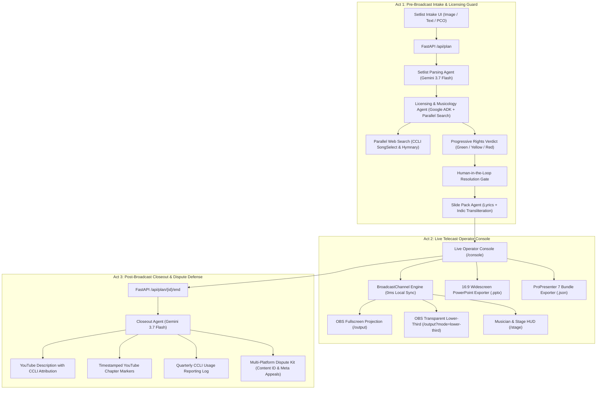
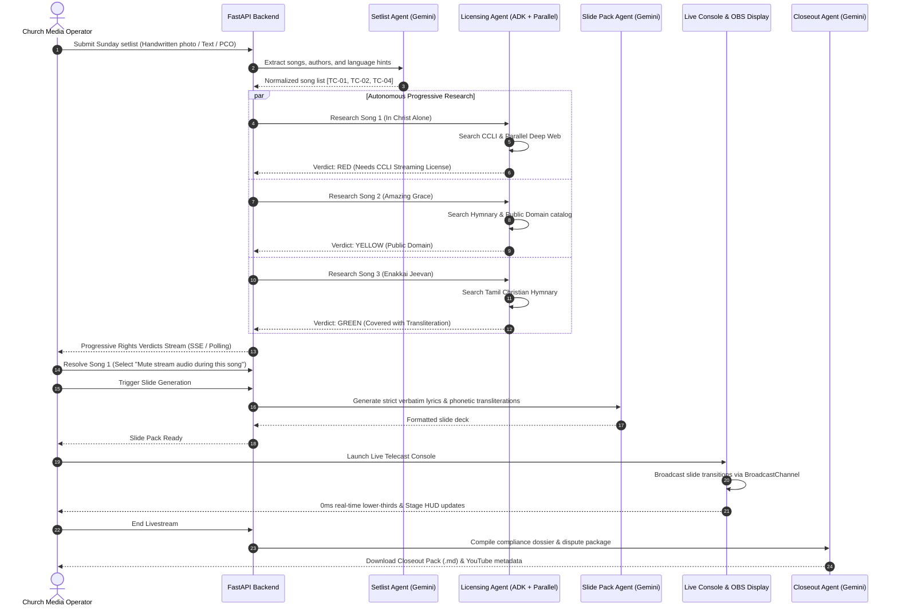
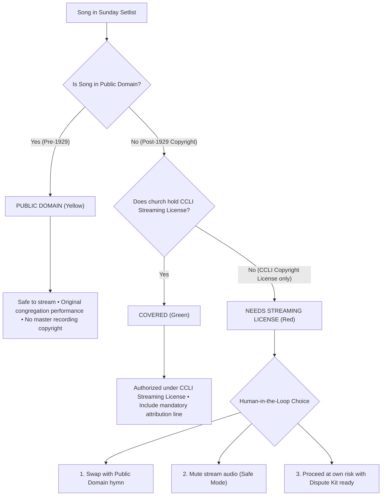
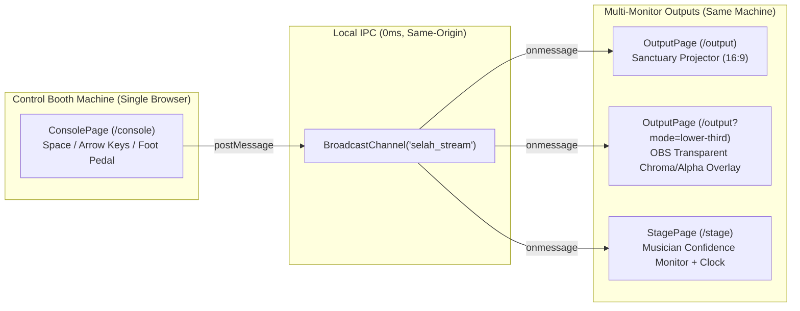
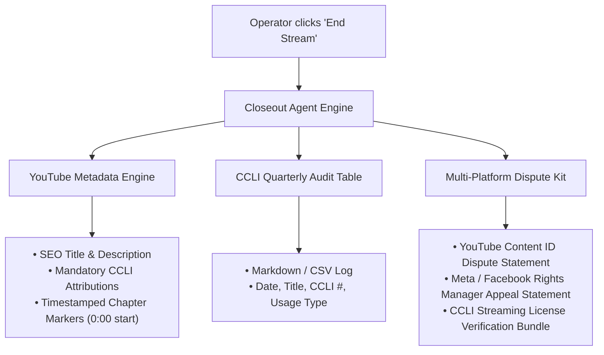

# 🕊️ Selah — Telecast Copilot System Architecture

> **Selah** is a production-grade live telecast copilot and copyright compliance engine designed for church media teams. It orchestrates autonomous AI research agents (`google-adk` + `google-genai` + `parallel-web`) to protect live Sunday worship streams from algorithmic copyright mutes, Content ID takedowns, and licensing violations across three synchronized acts.

---

## 🏛️ High-Level System Architecture

---

## 🤖 Multi-Agent Orchestration & Data Pipeline

Selah utilizes specialized autonomous agents working in parallel to ensure broadcast integrity and legal safety:

---

## 🛡️ The 3-Layer Copyright Defense Model

---

## 🖥️ Live Telecast Display Synchronization Architecture

Selah uses the browser-native **`BroadcastChannel` API** for zero-latency multi-monitor synchronization from a single booth machine. All operator console, sanctuary projector, OBS overlay, and stage monitor tabs run in the same browser instance and sync via in-memory IPC with no network round-trip:

> **Scope Note:** `BroadcastChannel` is same-browser, same-origin only. This provides multi-monitor output from one control booth computer (the standard small-church setup). True multi-device sync across separate PCs (e.g., a dedicated projector machine) requires a network transport — the SSE stream endpoint (`/api/plan/{id}/stream`) already exists as the foundation for this roadmap feature.

---

## 🔒 Post-Broadcast Compliance & Dispute Pipeline

---

## ⚙️ Technical Specifications

| Tier | Component | Technology | Performance / Latency |
| :--- | :--- | :--- | :--- |
| **Frontend** | Live Console & Displays | React 19, Vite, Lucide Icons, BroadcastChannel API | `< 16ms` (60fps render) |
| **Backend** | REST & Agent Services | Python 3.12, FastAPI, Uvicorn | Sub-millisecond routing |
| **Agent Core** | Autonomous Agents | `google-adk` 2.7.0, `google-genai` 2.18.1 (`gemini-3.7-flash`) | Parallel multi-key rotation |
| **Grounding** | Deep Web Verification | `parallel-web` 1.3.0 (Parallel Search SDK) | `< 800ms` grounded search |
| **Packaging** | Native Slide Formats | `python-pptx` (16:9 Widescreen), JSON (ProPresenter 7) | Instant client-side download |
| **Deployment** | Serverless Container | Google Cloud Run, Cloud Build, Artifact Registry | $0.00 idle cost (`min-instances=0`) |
