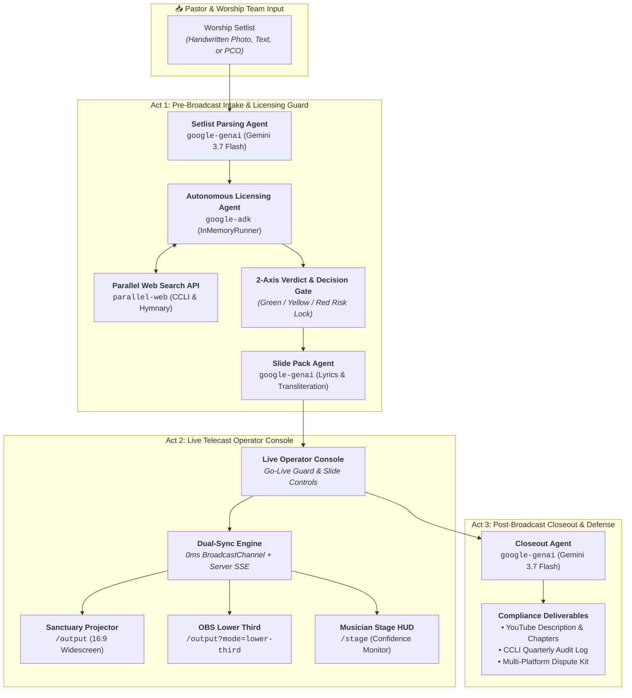

# 🕊️ Selah — Live Telecast Copilot for Church Media Volunteers

> **The pastor picks the songs. Selah makes sure the livestream doesn't get muted, the slides are ready, and the compliance paperwork is done.**

[](LICENSE)
[](https://agentic-cinema.devpost.com/)
[](https://parallel.ai)
[](https://ai.google.dev/)
[](ARCHITECTURE.md)
[](TESTING.md)

---

## 📖 The Problem

Every Sunday, thousands of churches hold valid music copyright licenses (e.g., CCLI Copyright & Streaming licenses) and **still get muted, claimed, or copyright-striked on YouTube and Facebook Live**.

### Why?
1. **CCLI licensing has zero API connection to YouTube's automated Content ID algorithm.** Content ID matches sound wave patterns to commercial label recordings, triggering automated mutes even when the church performs their own live acoustic rendition.
2. **Volunteers run Sunday booths.** Sunday morning livestreams are run by church volunteers (often teenagers or retirees) who just want to display lyrics. When an unexpected copyright strike or audio mute lands, panic ensues in the media booth.

### 🛡️ Selah's Strict Product Boundary:
**Selah never chooses the worship. It serves it.**  
The agent **never** suggests, recommends, ranks, or substitutes songs. Input is always the exact set list the pastor or worship leader chose. Red-verdict songs present **clear operational choices for humans** (*"Mute stream audio during this song"*, *"Confirm CCLI streaming coverage"*, or *"Verify public domain arrangement"*) — *never alternative songs*.

---

## 🏛️ System Architecture & Autonomous Agent Pipeline

Selah is built for the **Google Cloud "Agentic Cinema" Hackathon (Parallel Partner Track)**. All agent orchestration and grounded web research utilize official Google Cloud and Parallel runtime SDKs:



> 📄 **Complete Technical Specification**: For deep-dive sequence diagrams, fail-safe edge cases, and architectural data models, see [**`ARCHITECTURE.md`**](ARCHITECTURE.md).

---

## 🛠️ Verified Runtime Code Locations

1. **Google ADK (`google-adk` 2.7.0)**:
   - [`backend/app/agents/licensing_agent.py`](backend/app/agents/licensing_agent.py) — Defines `Agent(tools=[search_licensing_web])` and executes asynchronously with `InMemoryRunner.run_debug()`.
2. **Google GenAI (`google-genai` 2.18.1)**:
   - [`backend/app/services/gemini_client.py`](backend/app/services/gemini_client.py) — Multi-key rotation pool and structured Pydantic schema validation.
   - [`backend/app/agents/setlist_agent.py`](backend/app/agents/setlist_agent.py) — Multimodal OCR + text parsing.
   - [`backend/app/agents/pack_agent.py`](backend/app/agents/pack_agent.py) — Slide proofreading & Latin transliteration for Indic scripts.
   - [`backend/app/agents/closeout_agent.py`](backend/app/agents/closeout_agent.py) — Multi-platform compliance dossier and Content ID dispute statements.
3. **Parallel Search SDK (`parallel-web` 1.3.0)**:
   - [`backend/app/services/parallel_client.py`](backend/app/services/parallel_client.py) — Calls `Parallel(api_key).search()` with objective-driven search queries and trimmed citations (~900 chars).
4. **No Non-Google AI**: 100% powered by Gemini (`gemini-3.7-flash`). Zero OpenAI, Anthropic, or third-party AI audio-fingerprinting dependencies.

---

## ✨ Key Features Across the 3 Acts

### Act 1: Intake & Autonomous Rights Guard
- **Tri-Modal Setlist Ingestion**: Accepts raw typed text, Planning Center Services format, or photos of handwritten song lists.
- **1-Click Hackathon Judge Presets**: Instant benchmark evaluation buttons for standard praise, diaspora bilingual services, and compound medleys.
- **Autonomous Research Engine**: Parallel Web searches CCLI SongSelect and Hymnary to identify registered owners, CCLI song numbers, and public domain cutoff dates (pre-1929).
- **Progressive Rights Verdicts**: Green (Covered), Yellow (Public Domain), or Red (Action Required) with full cited web sources.
- **Human-in-the-Loop Decision Gate**: Unresolved red-verdict songs block the "Go Live" button until a volunteer explicitly chooses how to handle the broadcast risk.
- **Diaspora Transliteration**: Automatic Latin phonetic transliteration for Indian languages (Tamil, Malayalam, Hindi, Telugu) so non-native speakers can sing along.

### Act 2: Live Telecast Operator Console & Displays
- **Local Multi-Screen Sync**: Browser-native `BroadcastChannel` provides 0ms screen synchronization between the operator console, sanctuary projector, and broadcast overlays.
- **OBS / vMix Transparent Lower Thirds** (`/output?mode=lower-third`): Studio-grade transparent lower thirds with glassmorphism, gold accents, and diaspora sublines.
- **Musician Stage HUD** (`/stage`): Stage confidence monitor displaying active lyrics, amber *"Next Up"* line preview, live digital clock, section tags (`[Chorus]`), and audio safe-mute alerts.
- **Dual Presentation Hardware Export**: 1-Click download of **16:9 Widescreen PowerPoint (`.pptx`)** presentations and **ProPresenter 7 (`.json`)** bundles.
- **Hardware Foot Pedal & Keyboard Controls**: Supports USB foot pedals, wireless presenter remotes, `Space` / arrow keys, `Esc` (blackout), and `M` (safe audio mute).

### Act 3: Post-Broadcast Compliance & Dispute Defense
- **YouTube Metadata & Attributions**: Pre-formatted description with mandatory CCLI license attributions and 0:00-indexed timestamp chapters.
- **Quarterly CCLI Audit Table**: Ready-to-copy markdown table formatted for church administrative reporting.
- **Content ID Dispute Kit**: Pre-drafted YouTube Content ID and Meta / Facebook Rights Manager dispute statements with grounded web citations.
- **1-Click Markdown Download**: Export the entire compliance pack as a standalone `.md` document.

---

## 🎯 Benchmark Judge Test Cases

| Test Case | Scenario | Expected Agent Behavior |
| :--- | :--- | :--- |
| **TC-01** | *"In Christ Alone"* (Keith Getty) with CCLI Copyright License only | Flagged **RED** (Needs CCLI Streaming License). Blocks Go-Live until operator chooses Safe Mode or confirms streaming coverage. |
| **TC-02** | *"Amazing Grace"* (John Newton, 1779) | Flagged **YELLOW** (Public Domain). Notes composition is free from royalties; original church performance safe to stream. |
| **TC-03** | *"Way Maker"* (Sinach) with CCLI Streaming License | Flagged **GREEN** (Covered). Generates mandatory CCLI SongSelect attribution line for YouTube description. |
| **TC-04** | *"Enakkai Jeevan Vittavare"* (Tamil Worship) | Flagged **GREEN** with phonetic Latin transliteration generated for all verses and chorus slides. |
| **TC-05** | *"Way Maker / Great Are You Lord"* (Medley) | Decomposes compound slash setlist line into separate songs and evaluates rights independently. |

> 📋 **Judge & Evaluator Testing Guide**: For the full step-by-step walkthrough, 1-click test presets, API verification commands, and evaluation rubric alignment, see [**`TESTING.md`**](TESTING.md).

---

## 🚀 Local Development Quickstart

### Prerequisites
- Python 3.12+
- Node.js 20+
- Google Gemini API Key (`GEMINI_API_KEY`)
- Parallel Search API Key (`PARALLEL_API_KEY`)

### Setup Instructions

1. **Clone the repository**:
   ```bash
   git clone https://github.com/N-45div/Selah.git
   cd Selah
   ```

2. **Configure Environment Variables**:
   Create a `.env` file in the `backend/` directory:
   ```env
   GEMINI_API_KEY=your_gemini_api_key_here
   PARALLEL_API_KEY=your_parallel_api_key_here
   GEMINI_MODEL=gemini-3.7-flash
   ```

3. **Install Dependencies & Build Frontend**:
   ```bash
   # Install backend dependencies
   pip install -r backend/requirements.txt

   # Install frontend dependencies and build
   cd frontend
   npm install
   npm run build
   cd ..
   ```

4. **Run the Application**:
   ```bash
   # Launch with FastAPI
   uvicorn backend.app.main:app --host 0.0.0.0 --port 8000 --reload
   ```

5. **Open in Browser**:
   - Operator Console: `http://localhost:8000`
   - OBS Lower Third Overlay: `http://localhost:8000/output?mode=lower-third`
   - Musician Stage HUD: `http://localhost:8000/stage`

---

## 📄 License
This project is licensed under the MIT License — see the [LICENSE](LICENSE) file for details.
