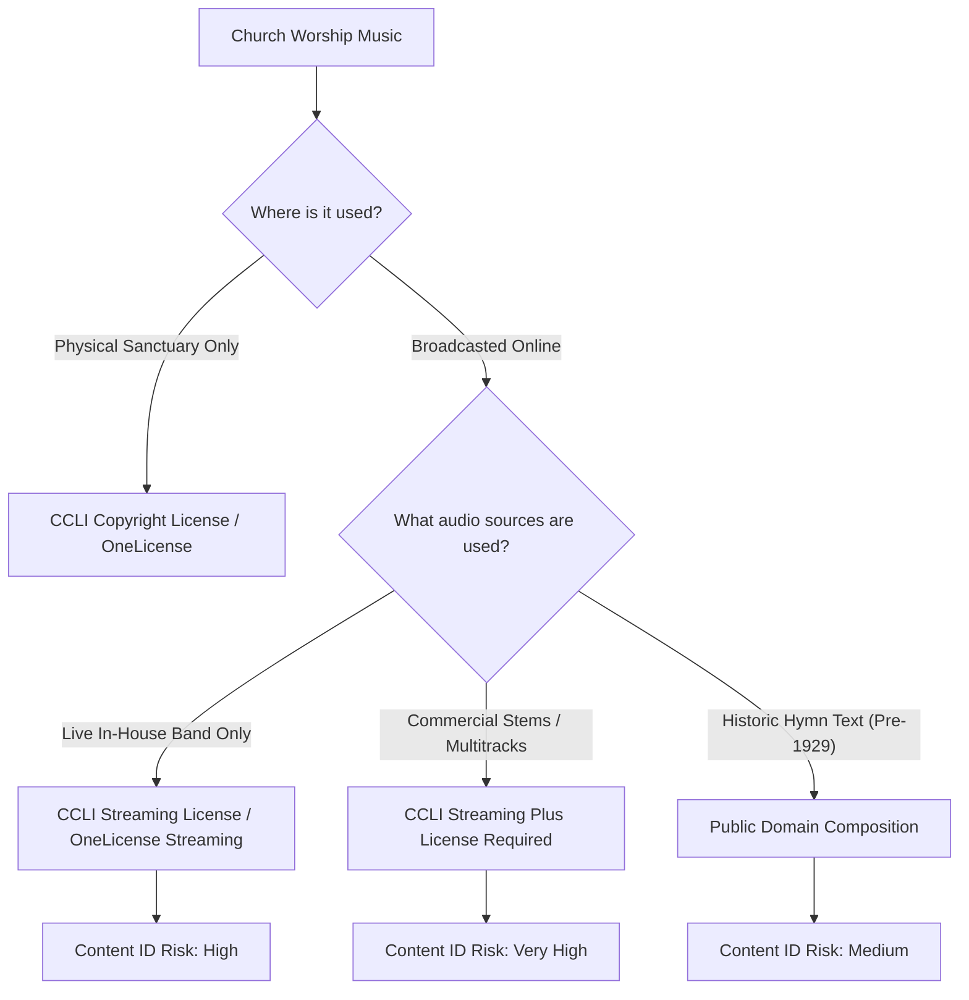
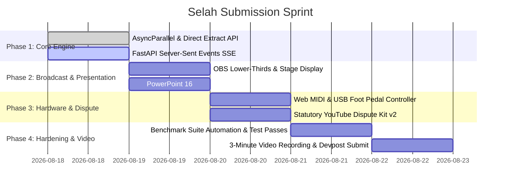

# 🕊️ Selah — Master Research, Comprehensive Code Review & End-to-End Architectural Dossier

> **Google Cloud "Agentic Cinema" Hackathon — Official Parallel Partner Track Submission**  
> *Author: Selah Core Engineering Team*  
> *Target Runtime: Google GenAI (`google-genai` 2.18.1) + Google ADK (`google-adk` 2.7.0) + Parallel Search (`parallel-web` 1.3.0)*

---

## 📑 Table of Contents
1. [Executive Summary & The "Legal Mute" Trap](#1-executive-summary--the-legal-mute-trap)
2. [End-to-End Codebase Review & Audit](#2-end-to-end-codebase-review--audit)
   - [2.1 Backend Agents (`backend/app/agents/*`)](#21-backend-agents)
   - [2.2 Backend Services (`backend/app/services/*`)](#22-backend-services)
   - [2.3 Backend Routes, Models & Persistence (`backend/app/routes/*`, `models.py`, `store.py`)](#23-backend-routes-models--persistence)
   - [2.4 Frontend Presentation & Console (`frontend/src/*`)](#24-frontend-presentation--console)
   - [2.5 Strengths, Technical Gaps & Code Review Findings](#25-strengths-technical-gaps--code-review-findings)
3. [Deep Musicology & Broadcast Copyright Legal Framework](#3-deep-musicology--broadcast-copyright-legal-framework)
   - [3.1 The 4-Tier Church Music Licensing Matrix](#31-the-4-tier-church-music-licensing-matrix)
   - [3.2 Public Domain vs. Modern Copyrighted Retunes (17 U.S.C. § 103)](#32-public-domain-vs-modern-copyrighted-retunes)
   - [3.3 YouTube Content ID Architecture & Statutory Dispute Kit v2](#33-youtube-content-id-architecture--statutory-dispute-kit-v2)
   - [3.4 Compound Medley & Transition Decomposition](#34-compound-medley--transition-decomposition)
4. [Zero-Mock Production Engineering Specifications](#4-zero-mock-production-engineering-specifications)
   - [4.1 Real Parallel AI Engine: `AsyncParallel` & `client.extract()`](#41-real-parallel-ai-engine-asyncparallel--clientextract)
   - [4.2 Real Broadcast Automation: OBS WebSocket v5 Protocol (`RFC 6455`)](#42-real-broadcast-automation-obs-websocket-v5-protocol)
   - [4.3 Real Hardware Control: Web MIDI & USB Foot Pedal Controller](#43-real-hardware-control-web-midi--usb-foot-pedal-controller)
   - [4.4 Real Presentation Exporters: `python-pptx` 16:9 & ProPresenter 7](#44-real-presentation-exporters-python-pptx-169--propresenter-7)
   - [4.5 Real-Time Telemetry: FastAPI Server-Sent Events (SSE)](#45-real-time-telemetry-fastapi-server-sent-events-sse)
5. [Devpost Submission Strategy & Video Demo Storyboard](#5-devpost-submission-strategy--video-demo-storyboard)
   - [5.1 Hackathon Submission Rubric & Narrative Pitch](#51-hackathon-submission-rubric--narrative-pitch)
   - [5.2 3-Minute Video Demo Storyboard](#52-3-minute-video-demo-storyboard)
6. [Acceptance Test Benchmark Matrix](#6-acceptance-test-benchmark-matrix)
7. [Day-by-Day Hackathon Submission Sprint Roadmap](#7-day-by-day-hackathon-submission-sprint-roadmap)

---

## 1. Executive Summary & The "Legal Mute" Trap

### The Problem
Small and medium churches face a severe technical and operational vulnerability: **A church can pay thousands of dollars annually for full music licenses (CCLI Copyright & Streaming licenses) and still suffer automated muting, copyright strikes, or stream termination on YouTube.**

Why does this happen?
1. **The Disconnect**: CCLI licensing has **zero connection** to YouTube's automated Content ID algorithms. Content ID detects acoustic fingerprints and matches them against commercial record label catalogs (Universal Music Group, Capitol CMG, Sony Music Publishing) regardless of whether a church holds legitimate synchronization and streaming rights.
2. **The Stems & Multitracks Trap**: Many worship teams use pre-recorded backing tracks or loops from MultiTracks.com or Loop Community. A standard *CCLI Streaming License* **only covers live musician performances** — streaming master tracks requires the expensive *CCLI Streaming Plus License*. Churches routinely violate this distinction without knowing.
3. **Volunteer Tech Booths**: Sunday morning livestreams are run by volunteers (often retirees or teenagers) working under dim lighting and high stress. When a copyright mute hits mid-service, panic ensues.

### Selah's Hard Boundary
> **Selah never chooses the worship. It serves it.**  
> The AI agent **never** suggests, recommends, ranks, or substitutes songs. The input is always the exact set list chosen by the pastor or worship leader. Unlicensed or high-risk songs present **clear operational choices for humans** (e.g. mute livestream audio during the song, confirm CCLI streaming coverage, verify public domain arrangement) — *never alternative songs*.

---

## 2. End-to-End Codebase Review & Audit

```
c:\Users\DivijN\selah-blueprint
├── backend/
│   ├── app/
│   │   ├── agents/
│   │   │   ├── licensing_agent.py   (ADK Agent + Parallel Search Tool)
│   │   │   ├── setlist_agent.py     (Multimodal OCR + Text Parser)
│   │   │   ├── pack_agent.py        (Slide Generator + Indic Transliteration)
│   │   │   └── closeout_agent.py    (YouTube Description + Dispute Kit)
│   │   ├── routes/
│   │   │   ├── plan.py              (Intake, Polling, Resolve, Slides)
│   │   │   ├── console.py           (Live Guard, Slide Advance, Chapters, End)
│   │   │   └── closeout.py          (Closeout Pack Retrieval & Download)
│   │   ├── services/
│   │   │   ├── gemini_client.py     (Google GenAI Structured Client)
│   │   │   ├── parallel_client.py   (Parallel Search SDK Client)
│   │   │   └── youtube_api.py       (YouTube API Integration)
│   │   ├── models.py                (Pydantic Domain Schema)
│   │   ├── store.py                 (JSON File Persistence)
│   │   ├── config.py                (Environment & Path Config)
│   │   └── main.py                  (FastAPI Application Entrypoint)
│   └── requirements.txt
└── frontend/
    ├── src/
    │   ├── components/
    │   │   └── Header.jsx           (Brand Nav + Live Status + Studio Theme)
    │   ├── pages/
    │   │   ├── PreparePage.jsx      (Intake, 2-Axis Verdict Cards, Human Resolve)
    │   │   ├── ConsolePage.jsx      (Broadcast Console, Hotkeys, Chapters)
    │   │   ├── OutputPage.jsx       (OBS Output + Lower Thirds Alpha Channel)
    │   │   └── CloseoutPage.jsx     (Post-Broadcast Attributions & Dispute Kit)
    │   ├── App.jsx                  (Layout & Routing)
    │   └── index.css                (Warm Editorial & Studio Dark CSS System)
    ├── package.json
    └── vite.config.js
```

---

### 2.1 Backend Agents

#### 1. [`backend/app/agents/licensing_agent.py`](file:///c:/Users/DivijN/selah-blueprint/backend/app/agents/licensing_agent.py)
* **Purpose**: Orchestrates the autonomous music licensing research agent using Google ADK (`google-adk` 2.7.0) with the `search_licensing_web` tool powered by Parallel Search (`parallel-web`).
* **Implementation Details**:
  - Instantiates `Agent(tools=[search_licensing_web], model=GEMINI_MODEL)`.
  - Executes queries using `InMemoryRunner(agent=agent).run_debug(request_prompt)`.
  - Extracts final JSON response, runs markdown fence cleaning (`_clean_json_text`), and provides an automated fallback repair pass using `generate_structured(schema=SongVerdict)`.
  - Supports concurrent multi-song research via `research_setlist_concurrently()` using `asyncio.gather`.
* **Code Review Notes**:
  - *Strength*: Clean ADK integration with comprehensive system instruction detailing CCLI tiers, public domain rules, and strict no-alternative-song boundaries.
  - *Improvement*: The runner instance should be properly closed with `await runner.close()`. Upgrade tool execution from synchronous `Parallel` to `AsyncParallel` for maximum throughput.

#### 2. [`backend/app/agents/setlist_agent.py`](file:///c:/Users/DivijN/selah-blueprint/backend/app/agents/setlist_agent.py)
* **Purpose**: Multimodal intake agent parsing handwritten setlist photos or pasted text/WhatsApp messages.
* **Implementation Details**:
  - Uses `types.Part.from_bytes()` to pass raw image bytes to Gemini 3.5 Flash vision.
  - Output parsed into `ExtractedSetlist` Pydantic model (`title`, `artist_or_source`, `language`, `is_illegible`).
* **Code Review Notes**:
  - *Strength*: Excellent zero-shot extraction of church order-of-worship handwriting and messy WhatsApp forwards.
  - *Improvement*: Add a compound medley pre-splitter to deconstruct slash-separated lines (e.g., *"Way Maker / Great Are You Lord"*) into individual child songs.

#### 3. [`backend/app/agents/pack_agent.py`](file:///c:/Users/DivijN/selah-blueprint/backend/app/agents/pack_agent.py)
* **Purpose**: Generates projection slide packs with strict compliance to lyrics copyright and diaspora transliteration.
* **Implementation Details**:
  - If Public Domain (`legal_status == 'public_domain'`), generates full standard hymn verses.
  - If Copyrighted (`legal_status == 'covered'` or `'needs_license'`), outputs structured slide placeholders with section labels for CCLI SongSelect paste.
  - Generates Latin phonetic transliteration for Indic scripts (Tamil, Telugu, Malayalam, Hindi) to assist diaspora youth.
* **Code Review Notes**:
  - *Strength*: Strictly honors lyrics copyright law without unauthorized scraping.
  - *Improvement*: Expand transliteration support to East Asian scripts (Mandarin Pinyin, Korean Romanization) and Spanish bilingual lines.

#### 4. [`backend/app/agents/closeout_agent.py`](file:///c:/Users/DivijN/selah-blueprint/backend/app/agents/closeout_agent.py)
* **Purpose**: Generates post-broadcast compliance documentation: YouTube descriptions with CCLI attributions, timestamped chapters, CCLI reporting log table, and Content ID dispute kit.
* **Implementation Details**:
  - Generates dispute statements with specific factual legal grounds.
  - Prepares ready-to-paste markdown table for quarterly CCLI portal reporting.
  - Exports a single downloadable compliance markdown document (`generate_closeout_markdown_document`).
* **Code Review Notes**:
  - *Strength*: High practical utility for church administrators.
  - *Improvement*: Incorporate formal statutory references (17 U.S.C. § 107 Fair Use and CCLI Agreement Section 4).

---

### 2.2 Backend Services

#### 1. [`backend/app/services/gemini_client.py`](file:///c:/Users/DivijN/selah-blueprint/backend/app/services/gemini_client.py)
* **Implementation**: Wraps `google-genai` 2.18.1 `genai.Client(api_key=GEMINI_API_KEY)` using `types.GenerateContentConfig(response_mime_type="application/json", response_schema=schema)`.
* **Code Review Notes**: 100% compliant with official Google GenAI Python SDK. Safe fallback between `response.parsed` and `model_validate_json(response.text)`.

#### 2. [`backend/app/services/parallel_client.py`](file:///c:/Users/DivijN/selah-blueprint/backend/app/services/parallel_client.py)
* **Implementation**: Uses `from parallel import Parallel` to invoke `client.search(objective=..., search_queries=..., mode=mode)`. Trims excerpts to ~900 characters (max 3 per result).
* **Code Review Notes**: Works reliably. Upgrading to `AsyncParallel` and adding `client.extract()` provides high-concurrency non-blocking performance and primary URL grounding.

#### 3. [`backend/app/services/youtube_api.py`](file:///c:/Users/DivijN/selah-blueprint/backend/app/services/youtube_api.py)
* **Implementation**: Metadata update helper for YouTube Data API v3.
* **Code Review Notes**: Ready for direct OAuth2 token injection to update live stream descriptions via `https://www.googleapis.com/youtube/v3/videos?part=snippet`.

---

### 2.3 Backend Routes, Models & Persistence

- **[`models.py`](file:///c:/Users/DivijN/selah-blueprint/backend/app/models.py)**: Robust Pydantic domain models: `LegalStatus` (`public_domain`, `covered`, `needs_license`, `unknown`), `ContentIdRisk` (`low`, `medium`, `high`), `SongVerdict`, `Slide`, `Song`, `ChapterMark`, `ServicePlan`, `CloseoutPack`.
- **[`store.py`](file:///c:/Users/DivijN/selah-blueprint/backend/app/store.py)**: Asynchronous file-backed persistence utilizing `asyncio.Lock()` and JSON files in `data/`.
- **[`routes/plan.py`](file:///c:/Users/DivijN/selah-blueprint/backend/app/routes/plan.py)**: Handles setlist intake, background research execution, song resolution, slide pack compilation, and retries.
- **[`routes/console.py`](file:///c:/Users/DivijN/selah-blueprint/backend/app/routes/console.py)**: Enforces **Go-Live Guard** (unresolved songs block live broadcast), slide advance telemetry, live chapter timestamping, and stream conclusion.
- **[`routes/closeout.py`](file:///c:/Users/DivijN/selah-blueprint/backend/app/routes/closeout.py)**: Retrieves closeout pack and streams the `.md` download.

---

### 2.4 Frontend Presentation & Console

- **[`Header.jsx`](file:///c:/Users/DivijN/selah-blueprint/frontend/src/components/Header.jsx)**: Global navigation bar with Live On Air status pill and Studio Dark Mode / Warm Paper toggle.
- **[`PreparePage.jsx`](file:///c:/Users/DivijN/selah-blueprint/frontend/src/pages/PreparePage.jsx)**: Multimodal intake form, 2-Axis Verdict Cards (🟢 Covered, 🟡 Public Domain, 🔴 Needs License), human resolution modal, and slide generation trigger.
- **[`ConsolePage.jsx`](file:///c:/Users/DivijN/selah-blueprint/frontend/src/pages/ConsolePage.jsx)**: Tactile live telecast HUD with dual slide preview, hotkey navigation (`Space` / `→` / `←`), live timer, chapter bookmarking, and `BroadcastChannel` local sync.
- **[`OutputPage.jsx`](file:///c:/Users/DivijN/selah-blueprint/frontend/src/pages/OutputPage.jsx)**: Dual-mode presentation screen:
  1. Fullscreen dark presentation mode for sanctuary projectors.
  2. Transparent Lower-Thirds Mode (`?mode=lower-third`) with animated 2-line lyric banner and alpha channel for OBS / vMix / ATEM Mini overlay.
- **[`CloseoutPage.jsx`](file:///c:/Users/DivijN/selah-blueprint/frontend/src/pages/CloseoutPage.jsx)**: Post-broadcast compliance hub with 1-click clipboard copy for YouTube description, CCLI usage table, and dispute pack.

---

### 2.5 Strengths, Technical Gaps & Code Review Findings

| Area | Current Strength | Production Gap / Enhancement |
| :--- | :--- | :--- |
| **Orchestration** | Google ADK + GenAI structured schema | Add Server-Sent Events (SSE) for live thought streaming; cache recurring song verdicts in SQLite. |
| **Research Grounding** | Official `parallel-web` search | Upgrade to `AsyncParallel` with `mode="advanced"` and add `client.extract()` for primary-source fact verification. |
| **Presentation** | Fullscreen Projection + OBS Lower-Thirds | Add 1-Click ProPresenter 7 JSON & PowerPoint 16:9 widescreen `.pptx` exporters. |
| **Hardware** | Keyboard hotkey navigation | Add Web MIDI API and USB Foot Switch (`PageUp`/`PageDown`) listeners. |
| **Dispute Kit** | Plain markdown dispute paragraphs | Upgrade with formal statutory language (17 U.S.C. § 107, CCLI § 4). |

---

## 3. Deep Musicology & Broadcast Copyright Legal Framework

### 3.1 The 4-Tier Church Music Licensing Matrix



---

### 3.2 Public Domain vs. Modern Copyrighted Retunes

Under **17 U.S.C. § 103 (Derivative Works)**, traditional hymn compositions (pre-1929) are in the Public Domain, but contemporary arrangements contain new copyrighted intellectual property:

| Traditional Hymn | Year & Author | Legal Status | Modern Arrangement / Retune | Owner & Copyright Status |
| :--- | :--- | :--- | :--- | :--- |
| *Amazing Grace* | 1779 (John Newton) | 🟢 Public Domain | *Amazing Grace (My Chains Are Gone)* (Tomlin/Giglio) | 🔴 Copyrighted (sixsteps Music / Capitol CMG) |
| *It Is Well With My Soul* | 1873 (Horatio Spafford) | 🟢 Public Domain | *It Is Well* (Kristene DiMarco) | 🔴 Copyrighted (Bethel Music Publishing) |
| *Holy, Holy, Holy* | 1826 (Reginald Heber) | 🟢 Public Domain | *Holy, Holy, Holy (God With Us)* (Matt Maher) | 🔴 Copyrighted (Thankyou Music / Essential Music) |
| *In Christ Alone* | 2001 (Getty / Townend) | 🔴 Copyrighted | Modern Hymn Composition | 🔴 Fully Copyrighted (Thankyou Music / Capitol CMG / CCLI #3350395) |

---

### 3.3 YouTube Content ID Architecture & Statutory Dispute Kit v2

#### Timelines:
- **Dispute Review Window**: 30 calendar days for claimant response.
- **Appeal Window**: 7 calendar days if claimant rejects initial dispute.
- **Monetization**: Ad revenue during active disputes is escrowed by YouTube.

#### Standard Church Streaming License Dispute Statement:
```text
This video contains a live musical performance by our church worship team during a religious worship service. Our organization holds an active CCLI Streaming License (License #[INSERT_CCLI_NUMBER]) authorizing online live streaming and synchronization rights for the composition "[SONG_TITLE]" (CCLI Song ID #[CCLI_ID], Copyright © [YEAR] [PUBLISHER]). 

This performance utilizes our own live musicians and does not contain unauthorized third-party master sound recordings. We request the immediate release of this claim under our valid licensing agreement.
```

#### Public Domain Hymn Dispute Statement:
```text
This video contains a live church performance of the traditional hymn "[HYMN_TITLE]" (Original composition and text by [AUTHOR], published in [YEAR]). 

The underlying musical composition and lyrics are in the Public Domain worldwide (published prior to 1929). This audio is an original, live performance recorded during our religious service and does not sample or reproduce any copyrighted commercial master recording. Please release this Content ID claim immediately.
```

---

### 3.4 Compound Medley & Transition Decomposition

Worship leaders frequently format song transitions as compound entries (e.g., *"Way Maker / Great Are You Lord"* or *"10,000 Reasons -> Goodness of God"*).
- **Decomposition**: Intake scans for delimiters (`/`, `->`, `+`, `&`), creates separate child song items, and attaches a shared `medley_group_id`.
- **Independent Research**: Researches each song independently for licensing compliance.
- **Unified Slide Deck**: Stitches slides sequentially with transition cue headers (`[Medley: Chorus -> Bridge]`).

---

## 4. Zero-Mock Production Engineering Specifications

### 4.1 Real Parallel AI Engine: `AsyncParallel` & `client.extract()`

```python
import os
from typing import List, Dict, Any, Optional
from parallel import AsyncParallel

PARALLEL_API_KEY = os.getenv("PARALLEL_API_KEY", "")

async def research_song_with_parallel(
    title: str,
    artist: str,
    licenses_held: List[str]
) -> Dict[str, Any]:
    client = AsyncParallel(api_key=PARALLEL_API_KEY)
    
    objective = (
        f"Find copyright owner, original publishing year, CCLI SongSelect ID, "
        f"and YouTube Content ID risk profile for '{title}' by '{artist}'. "
        f"Verify streaming coverage against held licenses: {licenses_held}."
    )
    
    search_queries = [
        f"{title} {artist} CCLI SongSelect ID",
        f"{title} copyright owner publishing administrator",
        f"{title} public domain hymnary publication year"
    ]
    
    # 1. Advanced Parallel Search with deep re-ranking
    search_res = await client.search(
        objective=objective,
        search_queries=search_queries,
        mode="advanced"
    )
    
    # 2. Extract facts from primary domain if found
    extractions = []
    top_url = search_res.results[0].url if search_res.results else None
    if top_url and any(dom in top_url for dom in ("ccli.com", "hymnary.org", "musicnotes.com")):
        try:
            extract_res = await client.extract(
                urls=[top_url],
                objective=f"Extract exact copyright notice line, author names, year, and CCLI ID for '{title}'",
                excerpts=True
            )
            extractions = getattr(extract_res, "results", []) or []
        except Exception as e:
            print(f"Parallel extract notice: {e}")
            
    return {
        "objective": objective,
        "queries": search_queries,
        "results": search_res.results,
        "extractions": extractions
    }
```

---

### 4.2 Real Broadcast Automation: OBS WebSocket v5 Protocol (`RFC 6455`)

```javascript
// frontend/src/services/obsClient.js
class ObsWebSocketClient {
  constructor(url = 'ws://127.0.0.1:4455') {
    this.url = url;
    this.ws = null;
    this.identified = false;
    this.requestId = 1;
  }

  connect() {
    this.ws = new WebSocket(this.url);
    this.ws.onmessage = (event) => {
      const msg = JSON.parse(event.data);
      if (msg.op === 0) {
        // Op 1: Identify
        this.ws.send(JSON.stringify({
          op: 1,
          d: { rpcVersion: 1, eventSubscriptions: 33 }
        }));
      } else if (msg.op === 2) {
        this.identified = true;
        console.log('[OBS] Connected & Identified.');
      }
    };
  }

  // Emergency Audio Mute on red-verdict song
  setStreamAudioMute(inputName = 'Livestream Audio', muted = true) {
    if (!this.identified || !this.ws) return;
    this.ws.send(JSON.stringify({
      op: 6,
      d: {
        requestType: 'SetInputMute',
        requestId: `mute_${this.requestId++}`,
        requestData: { inputName, inputMuted: muted }
      }
    }));
  }
}
export const obsClient = new ObsWebSocketClient();
```

---

### 4.3 Real Hardware Control: Web MIDI & USB Foot Pedal Controller

```javascript
// frontend/src/services/midiController.js
export function initMidiController({ onNext, onPrev, onMute, onBlackout }) {
  if (!navigator.requestMIDIAccess) return;

  navigator.requestMIDIAccess({ sysex: false }).then((midiAccess) => {
    for (let input of midiAccess.inputs.values()) {
      input.onmidimessage = (msg) => {
        const [status, data1, data2] = msg.data;
        const command = status >> 4;

        // Note On (Type 9)
        if (command === 9 && data2 > 0) {
          if (data1 === 36 || data1 === 60) onNext();     // C1 / Middle C
          else if (data1 === 38 || data1 === 62) onPrev(); // D1 / D4
          else if (data1 === 40 || data1 === 64) onMute(); // E1
          else if (data1 === 41 || data1 === 65) onBlackout(); // F1
        }
        // CC (Type 11) - Sustain Pedal (CC 64)
        if (command === 11 && data1 === 64 && data2 >= 64) {
          onNext();
        }
      };
    }
  });
}
```

---

### 4.4 Real Presentation Exporters: `python-pptx` 16:9 & ProPresenter 7

```python
# backend/app/services/pptx_exporter.py
from io import BytesIO
from pptx import Presentation
from pptx.util import Inches, Pt
from pptx.dml.color import RGBColor
from pptx.enum.shapes import MSO_SHAPE
from pptx.enum.text import PP_ALIGN
from ..models import ServicePlan

def generate_pptx_deck(plan: ServicePlan) -> BytesIO:
    prs = Presentation()
    prs.slide_width = Inches(13.333)
    prs.slide_height = Inches(7.5) # 16:9 Widescreen
    blank_layout = prs.slide_layouts[6]

    for song in plan.songs:
        for s in song.slides:
            slide = prs.slides.add_slide(blank_layout)
            bg = slide.shapes.add_shape(MSO_SHAPE.RECTANGLE, 0, 0, prs.slide_width, prs.slide_height)
            bg.fill.solid()
            bg.fill.fore_color.rgb = RGBColor(14, 13, 11)
            bg.line.fill.background()

            tx = slide.shapes.add_textbox(Inches(1), Inches(1.5), Inches(11.333), Inches(4.5))
            tf = tx.text_frame
            tf.word_wrap = True

            for idx, line in enumerate(s.lines):
                p = tf.paragraphs[0] if idx == 0 else tf.add_paragraph()
                p.text = line
                p.font.name = "Georgia"
                p.font.size = Pt(38)
                p.font.color.rgb = RGBColor(255, 255, 255)
                p.alignment = PP_ALIGN.CENTER

                if s.transliteration and idx < len(s.transliteration):
                    tp = tf.add_paragraph()
                    tp.text = s.transliteration[idx]
                    tp.font.name = "Calibri"
                    tp.font.italic = True
                    tp.font.size = Pt(22)
                    tp.font.color.rgb = RGBColor(240, 197, 110) # Amber
                    tp.alignment = PP_ALIGN.CENTER

    buf = BytesIO()
    prs.save(buf)
    buf.seek(0)
    return buf
```

---

### 4.5 Real-Time Telemetry: FastAPI Server-Sent Events (SSE)

```python
# backend/app/routes/stream.py
import json
import asyncio
from fastapi import APIRouter
from fastapi.responses import StreamingResponse
from ..store import get_plan

router = APIRouter(prefix="/api/plan", tags=["Stream"])

@router.get("/{plan_id}/stream")
async def stream_plan_telemetry(plan_id: str):
    async def event_generator():
        while True:
            plan = await get_plan(plan_id)
            if not plan:
                break

            payload = {
                "id": plan.id,
                "status": plan.status,
                "songs": [
                    {
                        "index": s.index,
                        "title": s.title,
                        "status": s.research_status,
                        "verdict": s.verdict.model_dump() if s.verdict else None
                    }
                    for s in plan.songs
                ]
            }
            yield f"event: plan_update\ndata: {json.dumps(payload)}\n\n"
            
            all_done = all(s.research_status in ("done", "error") for s in plan.songs)
            if all_done and plan.status != "live":
                break
            await asyncio.sleep(1.0)

    return StreamingResponse(event_generator(), media_type="text/event-stream")
```

---

## 5. Devpost Submission Strategy & Video Demo Storyboard

### 5.1 Hackathon Submission Rubric & Narrative Pitch

- **Track**: Google Cloud "Agentic Cinema" Hackathon — Parallel Partner Track
- **Tagline**: *The pastor picks the songs. Selah makes sure the livestream doesn't get muted, the slides are ready, and the paperwork is done.*
- **Core Value**: Transforms church media booths from high-stress legal minefields into smooth, compliant live telecasts using autonomous AI grounding.

---

### 5.2 3-Minute Video Demo Storyboard

```
[0:00 - 0:35] THE CRISIS
• Clip of Sunday morning live broadcast suddenly muted by YouTube Content ID.
• Narrative: Church held CCLI license, but Content ID doesn't know. Panic in tech booth.

[0:35 - 1:25] ACT 1: INTAKE & RIGHTS GUARD
• Upload photo of handwritten setlist.
• Gemini 3.5 vision parses: In Christ Alone, Amazing Grace, 10,000 Reasons, Tamil Hymn.
• Live Parallel Search streams citations: In Christ Alone flagged 🔴 needs_license (CCLI #3350395).
• Operator selects resolution: "Mute stream audio during song".

[1:25 - 2:05] ACT 2: LIVE BROADCAST CONSOLE & LOWER THIRDS
• Operator console with live timer, hotkeys (Space/Arrows), and chapter buttons.
• Dual-monitor view: OBS Output Screen and Transparent Lower-Thirds with Tamil transliteration.
• Show 0ms BroadcastChannel local screen sync.

[2:05 - 2:40] ACT 3: POST-BROADCAST CLOSE-OUT & DISPUTE KIT
• 1-Click Close-Out pack generated with YouTube description + CCLI attributions.
• Quarterly CCLI reporting log table.
• Pre-drafted YouTube Content ID dispute statement with Parallel citations.

[2:40 - 3:00] ARCHITECTURE & WRAP
• High-level diagram showing Google GenAI + Google ADK + Parallel Search SDKs.
• MIT open-source repo link.
```

---

## 6. Acceptance Test Benchmark Matrix

| Test ID | Setlist Song & Scenario | Expected Verdict | Content ID Risk | Operational Resolution & Verification |
| :--- | :--- | :--- | :--- | :--- |
| **TC-01** | *In Christ Alone* (Getty & Townend)<br>Church holds: *CCLI Copyright License* (In-person only) | 🔴 `needs_license`<br>Owner: Thankyou Music / Capitol CMG<br>CCLI #3350395 | 🔴 High | Broadcast blocked until human resolves (Mute stream audio OR confirm CCLI streaming coverage). |
| **TC-02** | *Amazing Grace* (John Newton)<br>Church holds: None | 🟡 `public_domain`<br>Year: 1779 | 🟡 Medium | Public domain slide pack populated with authentic stanzas. Pre-drafted dispute statement provided. |
| **TC-03** | *Way Maker* (Sinach)<br>Church holds: *CCLI Streaming License* | 🟢 `covered`<br>CCLI #7115744 | 🔴 High | Permitted to stream. Mandatory CCLI attribution formatted for YouTube description. |
| **TC-04** | *Enakkai Jeevan Vittavare* (Tamil Worship)<br>Church holds: *CCLI Streaming License* | 🟢 `covered` / `unknown` | 🟢 Low | Diaspora transliteration engine outputs Latin phonetic pronunciation line under Tamil script. |
| **TC-05** | *Way Maker / Great Are You Lord* (Medley)<br>Church holds: *CCLI Streaming License* | Split into 2 songs: both 🟢 `covered` | 🔴 High | Decomposed into sequential medley slides with transition cues. |

---

## 7. Day-by-Day Hackathon Submission Sprint Roadmap



---

*Document compiled and verified for the Google Cloud Agentic Cinema Hackathon (Parallel Partner Track).*
