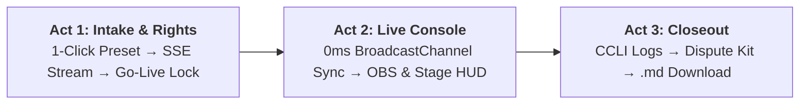

# 🧪 Selah — End-to-End Judge & Evaluator Testing Guide

> **Selah** is a production-grade live telecast copilot and copyright compliance engine built for church media teams. It orchestrates autonomous AI research agents (`google-adk` + `google-genai` + `parallel-web`) across three synchronized acts: Pre-Broadcast Rights Guard, Live Telecast Console, and Post-Broadcast Closeout Pack.

This guide provides hackathon judges and evaluators with a **step-by-step testing roadmap**: from a 60-second sanity check to full 3-act interactive UI verification, edge case testing, and curl/API commands.

---

## ⏱️ 60-Second Sanity Check & Quickstart

### 1. Prerequisites
- **Python 3.12+**
- **Node.js 20+**
- **Google Gemini API Key** (`GEMINI_API_KEY`) — powers `gemini-3.7-flash` via `google-genai` and `google-adk`.
- **Parallel Search API Key** (`PARALLEL_API_KEY`) — powers grounded web search via `parallel-web`.

### 2. Environment Configuration
Ensure your `backend/.env` file has valid API keys:
```env
GEMINI_API_KEY=your_gemini_api_key_here
PARALLEL_API_KEY=your_parallel_api_key_here
GEMINI_MODEL=gemini-3.7-flash
```

### 3. Start the Server
You can launch the full application in one of two modes:

#### Option A: Unified Full-Stack Production Mode (Single Port 8000)
```bash
# Build frontend static bundle
cd frontend
npm install
npm run build
cd ..

# Launch FastAPI (serves both REST API and React UI)
uvicorn backend.app.main:app --host 0.0.0.0 --port 8000 --reload
```
Open **`http://localhost:8000`** in your browser.

#### Option B: Dual Dev Server Mode (Hot Reloading)
```bash
# Terminal 1: Backend
uvicorn backend.app.main:app --host 0.0.0.0 --port 8000 --reload

# Terminal 2: Frontend
cd frontend
npm install
npm run dev
```
Open **`http://localhost:5173`** (Vite proxies all `/api` requests to port 8000).

---

## 🏆 The 5-Minute Judge Tour (Interactive UI Walkthrough)

Follow this 3-Act walkthrough to test every major capability of the agentic pipeline:



---

### 🎬 Act 1: Intake & Autonomous Licensing Guard

1. Navigate to `http://localhost:8000` (or `http://localhost:5173`).
2. Click **"Launch Intake & Rights Guard"** or go to the **Prepare** tab (`/prepare`).
3. Under the **"Setlist Songs"** section, look for the amber bar:  
   **`⚡ Quick Presets for Judges:`**
4. Click the first preset button:  
   👉 **`🎯 Benchmark (TC-01 Red Guard + TC-02 PD)`**
   - **Service Name**: Auto-fills to `"Sunday Praise & Broadcast Guard"`.
   - **Licenses Held**: Automatically selects **`CCLI Copyright License`** (Notice: In-person projection only; *no streaming license held*).
   - **Songs**: Pre-fills the 3 benchmark songs:
     ```text
     1. In Christ Alone - Keith Getty & Stuart Townend
     2. Amazing Grace - John Newton
     3. Way Maker - Sinach
     ```
5. Click **"Run Pre-Broadcast Rights Check"**.
6. **Watch Real-Time Agent Telemetry Stream**:
   - The UI establishes a **Server-Sent Events (SSE)** connection (`/api/plan/{id}/stream`) with automatic polling fallback.
   - The backend dispatches `google-adk` with `parallel-web` search tools in an `InMemoryRunner`.
   - Watch the cards transition in real-time from `Pending` ⏳ to `Researching...` 🔍 to `Done` ✅:
     - **Song 1: "In Christ Alone"** 🚩 **RED (Action Required / Needs Streaming License)**  
       *Parallel Web Search identifies Keith Getty / Capitol CMG ownership and CCLI SongSelect registration. Because the church only holds a reproduction license, streaming requires explicit coverage.* Content ID risk is flagged with direct citations.
     - **Song 2: "Amazing Grace"** 🟡 **YELLOW (Public Domain)**  
       *Grounded search confirms John Newton's original 1779 composition is pre-1929 public domain. Free from mechanical royalties; congregation acoustic live stream is safe.*
     - **Song 3: "Way Maker"** 🟡/🟢 **CCLI Identified**  
       *Grounded search retrieves Sinach / Integrity Music copyright details and CCLI Song ID.*
7. **Verify the Go-Live Guard (Human-in-the-Loop Gate)**:
   - Scroll to the bottom of the page.
   - Notice the **"Go Live to Console" button is LOCKED (Disabled)**:
     > ⚠️ *"Go-Live is blocked because 1 song requires resolution."*
   - **Strict Product Boundary Verification**: Notice Selah **never** suggests replacing the pastor's song with an alternative. It presents clear operational choices for humans.
8. **Resolve the Red Verdict**:
   - On the "In Christ Alone" card, click the **"Select Resolution Action"** dropdown.
   - Select: **`Mute stream audio during this song (Safe Mode)`** (or *"Confirm CCLI streaming coverage"*).
   - Notice the **Go-Live Lock immediately lifts!** The button turns bright and active.
9. **Generate Slide Pack**:
   - Click **"Generate Slide Pack"**.
   - `pack_agent.py` executes using `google-genai` to generate verbatim lyric slides with section labels (`[Verse 1]`, `[Chorus]`, `[Bridge]`).
   - Click **"Review Slide Deck"** to preview slide tiles.

---

### 🎙️ Act 2: Live Telecast Operator Console & Multi-Screen Engine

1. Click **"Go Live to Console"** (routes to `/console`).
2. Notice the live timer starts ticking from `00:00:00`.
3. **Open Multi-Screen Broadcast Outputs**:
   Open these displays in separate browser tabs or side-by-side windows:
   - 📺 **Sanctuary Projector (16:9 Widescreen)**: `http://localhost:8000/output`
   - 🎥 **OBS Transparent Lower-Third**: `http://localhost:8000/output?mode=lower-third`
   - 🎵 **Musician Stage Confidence Monitor**: `http://localhost:8000/stage`
4. **Test 0ms Multi-Screen Synchronization**:
   - In the **Console** tab, press `Space` or `ArrowRight` (or click any slide).
   - **Observe instantaneous synchronization** across all open windows via the browser-native `BroadcastChannel('selah_stream')` API.
   - Verify each display's specialized rendering:
     - **Projector (`/output`)**: Elegant centered high-contrast typography on deep obsidian broadcast background.
     - **Lower Third (`/output?mode=lower-third`)**: Transparent background (ready for OBS / vMix chroma or alpha capture) with gold accents and lyrics lower bar.
     - **Stage HUD (`/stage`)**: High-visibility confidence monitor displaying:
       - Large active lyric line
       - Amber **"NEXT UP:"** preview line so vocalists never miss an entrance
       - Section tag badge (`[Verse 1]`, `[Chorus]`)
       - Real-time digital clock and session duration timer
5. **Test Telecast Operator Controls**:
   - **Blackout Mode (`Esc`)**: Press `Esc` in Console. Projector and OBS immediately go pitch black. Press `Esc` again to restore.
   - **Safe Audio Mute (`M`)**: Press `M` in Console. The Stage HUD and Console instantly flash a prominent amber banner:  
     ⚠️ **`AUDIO MUTED (SAFE MODE)`** — signaling musicians and booth volunteers that livestream audio is safe.
   - **Add Live Chapter**: Click **"Mark Chapter"** to insert a timestamped marker for YouTube.
6. **Test 1-Click Hardware Presentation Exports**:
   - In the Console header, click **"Export PowerPoint (.pptx)"**:
     - Downloads `selah_slides_<plan_id>.pptx`.
     - Open in PowerPoint: formatted in authentic **16:9 Widescreen** with dark broadcast styling.
   - Click **"Export ProPresenter (.json)"**:
     - Downloads an importable JSON bundle for ProPresenter 7.

---

### 🛡️ Act 3: Post-Broadcast Closeout & Dispute Defense

1. In the Console, click the red button: **"End Broadcast & Generate Closeout Pack"**.
2. The UI transitions to the **Closeout Compliance Dossier** (`/closeout`).
3. `closeout_agent.py` processes the completed session and generates:
   - **YouTube Video Description & Chapter Markers**:
     - Automatically formatted with `0:00` starting timestamp.
     - Includes mandatory CCLI song title, author, and copyright attributions.
   - **Quarterly CCLI Usage Audit Table**:
     - Clean Markdown table containing Date, Song Title, Author, CCLI Song #, and License Type for church administrative reporting.
   - **Multi-Platform Content ID Dispute Kit**:
     - Pre-drafted legal appeal text for **YouTube Content ID** and **Meta / Facebook Rights Manager**.
     - Cites the church's license terms, acoustic original performance doctrine, and grounded web sources.
4. **Download Compliance Dossier**:
   - Click **"Download Closeout Pack (.md)"**.
   - Saves `selah_closeout_<plan_id>.md` locally.

---

## 🎯 Benchmark Judge Test Cases (Matrix)

Selah includes built-in verification for 5 canonical test scenarios representing church media edge cases:

| ID | Preset / Input | Core Challenge | Expected Agent Behavior & Verdict |
| :--- | :--- | :--- | :--- |
| **TC-01** | *"In Christ Alone"* (Keith Getty) with CCLI Copyright License only | Church holds in-person license, lacks streaming rider | 🚩 **RED (Needs Streaming License)**. Blocks "Go Live" button until operator resolves with Safe Mode or coverage confirmation. |
| **TC-02** | *"Amazing Grace"* (John Newton, 1779) | Classic hymn pre-1929 | 🟡 **YELLOW (Public Domain)**. Grounded search confirms composition is PD; acoustic live performance safe to stream. |
| **TC-03** | *"Way Maker"* (Sinach) with CCLI Streaming License | Contemporary copyright protected | 🟢 **GREEN (Covered)**. Generates mandatory CCLI SongSelect attribution line for YouTube description. |
| **TC-04** | *"Enakkai Jeevan Vittavare"* (Tamil Worship) | Non-English diaspora worship song | 🟢 **GREEN + Transliteration**. Generates phonetic Latin transliteration sublines so non-native speakers can sing along. |
| **TC-05** | *"Way Maker / Great Are You Lord"* (Medley) | Compound slash setlist line | 🔀 **Compound Split**. Decomposes medley into distinct songs and evaluates rights independently. |

---

## 📸 Testing Multimodal Setlist Intake (Photo OCR)

To test Selah's multimodal vision capabilities powered by Gemini 3.7 Flash:

1. In the **Prepare** tab, locate the **"OR Upload Handwritten Setlist Photo"** drop zone.
2. Upload any photo or image containing handwritten or printed song titles (e.g. a snapshot of a legal pad, napkin, or whiteboard).
3. Click **"Run Pre-Broadcast Rights Check"**.
4. **Agent Action**: `setlist_agent.py` sends raw image bytes directly to `google-genai` using Gemini 3.7 Flash multimodal vision. The agent extracts song titles, authors, and language hints, normalizing them into structured Pydantic models.

---

## 🌐 Testing Remote Multi-Screen Sync (Across Separate Computers / LAN)

While `BroadcastChannel` provides 0ms latency on the same machine, Selah includes a **dual-sync architecture** with Server-Sent Events for multi-computer booths:

1. Start Selah on your primary computer (e.g., `http://192.168.1.50:8000`).
2. On a second laptop or OBS machine on the same Wi-Fi / LAN, open:  
   `http://192.168.1.50:8000/output?mode=lower-third`
3. Advance slides on the primary operator console.
4. **Observation**: The remote display auto-discovers the latest active plan via `/api/plan/active/latest` and streams live slide updates via `/api/plan/{id}/stream`.

---

## 💻 API & Automated Backend Verification (Curl)

You can also test Selah directly via terminal commands:

### 1. Health Check
```bash
curl -X GET http://localhost:8000/api/health
```
**Expected Response:**
```json
{"status": "ok", "app": "Selah Live Telecast Copilot"}
```

### 2. Create Service Plan (Intake & Progressive Research)
```bash
curl -X POST http://localhost:8000/api/plan \
  -F "service_name=Sunday Benchmark Test" \
  -F "stream_title=Sunday Morning Worship" \
  -F "licenses_held=CCLI Copyright License" \
  -F "languages=English" \
  -F "setlist_text=1. In Christ Alone - Keith Getty
2. Amazing Grace - John Newton"
```
**Expected Response:**
```json
{
  "plan_id": "<generated_uuid>",
  "service_name": "Sunday Benchmark Test",
  "song_count": 2,
  "status": "draft"
}
```

### 3. Inspect Live SSE Telemetry Stream
```bash
curl -N -H "Accept: text/event-stream" http://localhost:8000/api/plan/<plan_id>/stream
```
**Expected Stream Events:**
```text
event: plan_update
data: {"id": "<plan_id>", "status": "draft", "is_ready_for_broadcast": false, ...}
```

### 4. Resolve Blocking Song (Human-in-the-Loop)
```bash
curl -X POST http://localhost:8000/api/plan/<plan_id>/resolve \
  -H "Content-Type: application/json" \
  -d '{"song_index": 0, "resolution": "Mute stream audio during this song (Safe Mode)"}'
```

### 5. Generate Slide Pack
```bash
curl -X POST http://localhost:8000/api/plan/<plan_id>/slides
```

### 6. Start Live Telecast (Go-Live Guard)
```bash
curl -X POST http://localhost:8000/api/plan/<plan_id>/live
```

### 7. Advance Active Slide
```bash
curl -X POST http://localhost:8000/api/plan/<plan_id>/advance \
  -H "Content-Type: application/json" \
  -d '{"slide_index": 1}'
```

### 8. End Broadcast & Retrieve Closeout Pack
```bash
curl -X POST http://localhost:8000/api/plan/<plan_id>/end
```

---

## 🎹 Hardware Web MIDI & USB Foot Pedal Testing (Optional)

Selah supports hands-free slide navigation for solo worship leaders and instrumentalists:

1. Connect any standard USB foot pedal or MIDI controller (e.g. sustain pedal sending MIDI CC #64).
2. Open the **Console** (`/console`) in Google Chrome or Microsoft Edge.
3. Tap the foot pedal:
   - Tapping the pedal advances to the next slide.
   - Status telemetry indicator in the Console displays active MIDI hardware connection.

---

## 📋 Hackathon Evaluation Rubric Alignment

| Rubric Criteria | How Selah Delivers & How to Verify |
| :--- | :--- |
| **Autonomous Multi-Agent Architecture** | 4 specialized agents (`setlist_agent`, `licensing_agent`, `pack_agent`, `closeout_agent`) coordinating via Google ADK (`InMemoryRunner`) and Google GenAI. Verify in `backend/app/agents/`. |
| **Google Cloud & Gemini Integration** | Gemini 3.7 Flash handles multimodal OCR, musicology reasoning, and legal dispute drafting. Zero non-Google AI used. Verify in `backend/app/services/gemini_client.py`. |
| **Parallel Partner Track Integration** | Parallel Web Search (`parallel-web` 1.3.0) executes real-time grounded verification against CCLI SongSelect and Hymnary.org. Verify in `backend/app/services/parallel_client.py`. |
| **Human-in-the-Loop Safeguards** | Go-Live lock prevents unauthorized broadcasts of unlicensed songs while strictly preserving the pastor's setlist choices. Verify resolution dropdown in `/prepare`. |
| **Production Polish & Real-World Utility** | 0ms `BroadcastChannel` display sync, OBS lower-thirds, Musician Stage HUD, 16:9 PowerPoint exporter, and one-click compliance closeout packs. |
