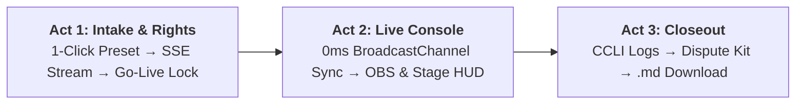

# 🧪 Selah — End-to-End Judge & Evaluator Testing Guide

> **Selah** is a production-grade live telecast copilot and copyright compliance engine built for church media teams. It orchestrates autonomous AI research agents (`google-adk` + `google-genai` + `parallel-web`) across three synchronized acts: Pre-Broadcast Rights Guard, Live Telecast Console, and Post-Broadcast Closeout Pack.

This guide provides hackathon judges and evaluators with a **step-by-step testing roadmap**: from zero-setup live cloud testing to full 3-act interactive UI verification, edge case testing, and curl/API commands.

---

## ⚡ Zero-Setup: Test on the Live Cloud Run Deployment

You **do not** need to install Python, Node, or configure API keys to evaluate Selah. The complete application is deployed and live on Google Cloud Run:

🌐 **Live Production App**:  
[**https://selah-telecast-copilot-898683614791.us-central1.run.app**](https://selah-telecast-copilot-898683614791.us-central1.run.app)

> 💡 **Note for CLI / Curl Testing**: Every curl command in this document works directly against the live deployment by swapping `http://localhost:8000` with `https://selah-telecast-copilot-898683614791.us-central1.run.app`.

---

## ⏱️ Local Development Setup (Optional for Deep Evaluation)

If you prefer to run and inspect the codebase locally on your workstation:

### 1. Prerequisites
- **Python 3.12+**
- **Node.js 20+**
- **Google Gemini API Key** (`GEMINI_API_KEY`) — powers `gemini-3.7-flash` via `google-genai` and `google-adk`.
- **Parallel Search API Key** (`PARALLEL_API_KEY`) — powers grounded web search via `parallel-web`.

### 2. Environment Configuration
Ensure your `backend/.env` file has valid API keys:
```env
GEMINI_API_KEY=your_gemini_api_key_here
PARALLEL_API_KEY=your_parallel_api_key_here
GEMINI_MODEL=gemini-3.7-flash
```

### 3. Launch Local Server
```bash
# Build frontend static bundle
cd frontend
npm install
npm run build
cd ..

# Launch FastAPI (serves both REST API and React UI on port 8000)
uvicorn backend.app.main:app --host 0.0.0.0 --port 8000 --reload
```
Open **`http://localhost:8000`** in your browser.

---

## 🏆 The 5-Minute Judge Tour (Interactive UI Walkthrough)

Follow this 3-Act walkthrough to test every major capability of the agentic pipeline:



---

### 🎬 Act 1: Intake & Autonomous Rights Guard

1. Navigate to `http://localhost:8000` (or the [hosted Cloud Run URL](https://selah-telecast-copilot-898683614791.us-central1.run.app)).
2. Click **"Launch Sunday Telecast Copilot"** (or click the **Prepare** tab in the navigation bar).
3. Under the **"Setlist Songs"** section, locate the quick judge presets bar:  
   **`⚡ Quick Presets for Judges:`**
4. Click the first preset button:  
   👉 **`🎯 Benchmark (TC-01 Red Guard + TC-02 PD)`**
   - **Service Name**: Auto-fills to `"Sunday Praise & Broadcast Guard"`.
   - **Licenses Held**: Automatically selects **`CCLI Copyright License`** (*Notice: In-person reproduction/projection only; no streaming license held*).
   - **Songs**: Pre-fills the 3 benchmark songs:
     ```text
     1. In Christ Alone - Keith Getty & Stuart Townend
     2. Amazing Grace - John Newton
     3. Way Maker - Sinach
     ```
5. Click the green button: **"Run Autonomous Rights & Content ID Research"**.
6. **Watch Real-Time Agent Telemetry Stream**:
   - The UI establishes a **Server-Sent Events (SSE)** connection (`/api/plan/{id}/stream`) with automatic polling fallback.
   - The backend dispatches `google-adk` with `parallel-web` search tools in an `InMemoryRunner`.
   - Watch the cards transition in real-time from `Pending` ⏳ to `Researching...` 🔍 to `Done` ✅:
     - **Song 1: "In Christ Alone"** 🚩 **RED (Needs License)**  
       *Parallel Web Search identifies Keith Getty / Capitol CMG ownership and CCLI SongSelect registration. Because the church holds only an in-person license, live streaming requires explicit coverage.*
     - **Song 2: "Amazing Grace"** 🟡 **YELLOW (Public Domain)**  
       *Grounded search confirms John Newton's original 1779 composition was published in 1930 or earlier (US Public Domain). Free from mechanical royalties; congregation acoustic live stream is safe.*
     - **Song 3: "Way Maker"** 🚩 **RED (Needs License)**  
       *Grounded search identifies Sinach / Integrity Music copyright. Because the church lacks a CCLI Streaming License, live streaming is uncovered.*
7. **Verify the Go-Live Guard (Human-in-the-Loop Gate)**:
   - Scroll to the bottom of the page.
   - Notice the **"Proceed to Live Broadcast Console" button is LOCKED (Disabled)**:
     > ⚠️ *"Go-Live is blocked because 2 songs require human resolution."*
   - **Strict Product Boundary Verification**: Notice Selah **never** suggests replacing the pastor's songs with alternatives. It presents clear operational choices for humans.
8. **Resolve Both Red Songs**:
   - On the **"In Christ Alone"** card, click the **"Choose Resolution"** button. A modal appears with 3 operational options. Select:  
     👉 **Option 1: "Mute stream audio during this song (Safe Mode)"**
   - On the **"Way Maker"** card, click the **"Choose Resolution"** button. Select:  
     👉 **Option 2: "Confirm license coverage"** (or Option 1: *"Mute stream audio"*).
   - Notice the **Go-Live Lock immediately lifts!** The **"Proceed to Live Broadcast Console"** button turns bright and active.
9. **Build Slide Pack**:
   - Click **"Build Slide Pack"**.
   - `pack_agent.py` executes using `google-genai` to generate verbatim lyric slides with section labels (`[Verse 1]`, `[Chorus]`, `[Bridge]`).

---

### 🎙️ Act 2: Live Telecast Operator Console & Multi-Screen Engine

1. Click **"Proceed to Live Broadcast Console"** (routes to `/console`).
2. Click the green button: **"Go Live Now"**.
3. Notice the live telecast timer starts ticking from `00:00`.
4. **Open Multi-Screen Broadcast Outputs**:
   Open these displays in separate browser tabs or side-by-side windows:
   - 📺 **Sanctuary Projector (16:9 Widescreen)**: `/output`
   - 🎥 **OBS Transparent Lower-Third**: `/output?mode=lower-third`
   - 🎵 **Musician Stage Confidence Monitor**: `/stage`
5. **Test 0ms Multi-Screen Synchronization**:
   - In the **Console** tab, press `Space` or `ArrowRight` (or click any slide).
   - **Observe instantaneous synchronization** across all open windows via the browser-native `BroadcastChannel('selah_stream')` API.
   - Verify each display's specialized rendering:
     - **Projector (`/output`)**: Elegant centered high-contrast typography on deep obsidian broadcast background.
     - **Lower Third (`/output?mode=lower-third`)**: Transparent background (ready for OBS / vMix chroma or alpha capture) with gold accents and lyrics lower bar.
     - **Stage HUD (`/stage`)**: High-visibility confidence monitor displaying:
       - Large active lyric line
       - Amber **"NEXT UP:"** preview line so vocalists never miss an entrance
       - Section tag badge (`[Verse 1]`, `[Chorus]`)
       - Real-time digital clock and session duration timer
6. **Test Telecast Operator Controls**:
   - **Blackout Mode (`Esc`)**: Press `Esc` in Console. Projector and OBS immediately go pitch black. Press `Esc` again to restore.
   - **Safe Audio Mute (`M`)**: Press `M` in Console. The Stage HUD and Console instantly flash a prominent amber banner:  
     ⚠️ **`AUDIO MUTED (SAFE MODE)`** — signaling musicians and booth volunteers that livestream audio is safe.
   - **Add Live Chapter**: Click **"Mark Chapter"** to insert a timestamped marker for YouTube.
7. **Test 1-Click Hardware Presentation Exports**:
   - In the Console header, click **"Download 16:9 PowerPoint Presentation (.pptx)"**:
     - Downloads `Selah_<Service_Name>_16x9.pptx` (or `selah_slides_<id>.pptx` via API).
     - Formatted in authentic **16:9 Widescreen** with dark broadcast styling.
   - Click **"Export ProPresenter 7 (.json)"**:
     - Downloads `Selah_<Service_Name>_Pro7.json` ready for ProPresenter 7.

---

### 🛡️ Act 3: Post-Broadcast Closeout & Dispute Defense

1. In the Console, click the red button: **"End Stream"**.
2. The UI transitions to the **Closeout Compliance Dossier** (`/closeout`).
3. `closeout_agent.py` processes the completed session and generates:
   - **YouTube Video Description & Chapter Markers**:
     - Automatically formatted with `0:00` starting timestamp.
     - Includes mandatory CCLI song title, author, and copyright attributions.
   - **Quarterly CCLI Usage Audit Table**:
     - Clean Markdown table containing Date, Song Title, Author, CCLI Song #, and License Type for church administrative reporting.
   - **Multi-Platform Content ID Dispute Kit**:
     - Pre-drafted legal appeal text for **YouTube Content ID** and **Meta / Facebook Rights Manager**.
     - Cites the church's license terms, acoustic original performance doctrine, and grounded web sources.
4. **Download Compliance Dossier**:
   - Click **"Download Full Markdown Pack (.md)"**.
   - Downloads `selah_closeout_<id>.md` locally.

---

## 🎯 Benchmark Judge Test Cases (Matrix)

Selah includes built-in verification for 5 canonical test scenarios representing church media edge cases:

| ID | Preset / Input | Core Challenge | Expected Agent Behavior & Verdict |
| :--- | :--- | :--- | :--- |
| **TC-01** | *"In Christ Alone"* (Keith Getty) with CCLI Copyright License only | Church holds in-person license, lacks streaming rider | 🚩 **RED (Needs License)**. Blocks Go-Live until operator chooses Safe Mode or confirms coverage. |
| **TC-02** | *"Amazing Grace"* (John Newton, 1779) | Classic hymn published in 1930 or earlier | 🟡 **YELLOW (Public Domain)**. Grounded search confirms composition is PD; acoustic live performance safe to stream. |
| **TC-03** | *"Way Maker"* (Sinach) with CCLI Streaming License | Contemporary copyright protected | 🟢 **GREEN (Covered)**. Generates mandatory CCLI SongSelect attribution line for YouTube description. |
| **TC-04** | *"Enakkai Jeevan Vittavare"* (Tamil Worship) | Non-English diaspora worship hymn | Expected: Coverage verdict plus phonetic Latin transliteration sublines (may return Unknown with worship leader verification option). |
| **TC-05** | *"Way Maker / Great Are You Lord"* (Medley) | Compound slash setlist line | 🔀 **Compound Split**. Decomposes medley into distinct songs and evaluates rights independently. |

---

## 📸 Testing Multimodal Setlist Intake (Photo OCR)

To test Selah's multimodal vision capabilities powered by Gemini 3.7 Flash:

1. In the **Prepare** tab, locate the **"OR Upload Handwritten Setlist Photo"** drop zone.
2. Upload any photo or image containing handwritten or printed song titles (e.g. a snapshot of a legal pad, napkin, or whiteboard).
3. Click **"Run Autonomous Rights & Content ID Research"**.
4. **Agent Action**: `setlist_agent.py` sends raw image bytes directly to `google-genai` using Gemini 3.7 Flash multimodal vision. The agent extracts song titles, authors, and language hints, normalizing them into structured Pydantic models.

---

## 🌐 Testing Remote Multi-Screen Sync (Across Separate Computers / LAN)

While `BroadcastChannel` provides 0ms latency on the same machine, Selah includes a **dual-sync architecture** with Server-Sent Events for multi-computer booths:

1. Start a broadcast session on your primary computer or open the [hosted Cloud Run URL](https://selah-telecast-copilot-898683614791.us-central1.run.app). Note the generated plan ID from the URL or console.
2. On a second laptop or OBS machine on the network, open the display URL appending your plan ID:  
   `https://<host>/output?mode=lower-third&plan=<plan_id>`  
   *(or `/stage?plan=<plan_id>` for the musician HUD)*
3. Advance slides on the primary operator console.
4. **Observation**: Passing `?plan=<plan_id>` directly binds the secondary display to your exact active telecast session via `/api/plan/{id}/stream`.

---

## 💻 API & Automated Backend Verification (Curl)

You can test Selah directly via terminal commands (substitute `http://localhost:8000` with the hosted Cloud Run URL if testing live):

### 1. Health Check
```bash
curl -X GET http://localhost:8000/api/health
```
**Expected Response:**
```json
{
  "ok": true,
  "app": "Selah",
  "version": "1.0.0",
  "gemini_keys_configured": 1,
  "parallel_configured": true,
  "sdk": "google-adk + google-genai + parallel-web"
}
```

### 2. Create Service Plan (Intake & Progressive Research)
```bash
curl -X POST http://localhost:8000/api/plan \
  -F "service_name=Sunday Benchmark Test" \
  -F "stream_title=Sunday Morning Worship" \
  -F "licenses_held=CCLI Copyright License" \
  -F "languages=English" \
  -F "setlist_text=1. In Christ Alone - Keith Getty
2. Amazing Grace - John Newton"
```
**Expected Response:**
```json
{
  "plan_id": "<generated_uuid>",
  "service_name": "Sunday Benchmark Test",
  "song_count": 2,
  "status": "draft"
}
```

### 3. Inspect Live SSE Telemetry Stream
```bash
curl -N -H "Accept: text/event-stream" http://localhost:8000/api/plan/<plan_id>/stream
```
**Expected Stream Events:**
```text
event: plan_update
data: {"id": "<plan_id>", "status": "draft", "plan": {...}, "current_slide_index": 0, "total_slides": 12, "active_slide": {...}, "next_slide": {...}, "blocking_count": 2, "blocking_indices": [0, 2], "is_ready_for_broadcast": false, "all_done": true}
```

### 4. Resolve Blocking Song (Human-in-the-Loop)
```bash
curl -X POST http://localhost:8000/api/plan/<plan_id>/resolve \
  -H "Content-Type: application/json" \
  -d '{"song_index": 0, "resolution": "Mute stream audio during this song (Safe Mode)"}'
```

### 5. Generate Slide Pack
```bash
curl -X POST http://localhost:8000/api/plan/<plan_id>/slides \
  -H "Content-Length: 0"
```

### 6. Start Live Telecast (Go-Live Guard)
*(Note: `-H "Content-Length: 0"` prevents HTTP 411 on Cloud Run proxy)*
```bash
curl -X POST http://localhost:8000/api/plan/<plan_id>/live \
  -H "Content-Length: 0"
```

### 7. Advance Active Slide
```bash
curl -X POST http://localhost:8000/api/plan/<plan_id>/advance \
  -H "Content-Type: application/json" \
  -d '{"slide_index": 1}'
```

### 8. End Broadcast & Retrieve Closeout Pack
```bash
curl -X POST http://localhost:8000/api/plan/<plan_id>/end \
  -H "Content-Length: 0"
```

---

## 🎹 Hardware Web MIDI & USB Foot Pedal Testing (Optional)

Selah supports hands-free slide navigation for solo worship leaders and instrumentalists:

1. Connect any standard USB foot pedal or MIDI controller (e.g. sustain pedal sending MIDI CC #64).
2. Open the **Console** (`/console`) in Google Chrome or Microsoft Edge.
3. Tap the foot pedal:
   - Tapping the pedal advances to the next slide.
   - Status telemetry indicator in the Console displays active MIDI hardware connection.

---

## 📋 Hackathon Evaluation Rubric Alignment

| Rubric Criteria | How Selah Delivers & How to Verify |
| :--- | :--- |
| **Autonomous Multi-Agent Architecture** | Specialized multi-agent architecture: `licensing_agent.py` orchestrates autonomous research via Google ADK (`InMemoryRunner`) with dynamic tool calling to `parallel-web`; `setlist_agent.py`, `pack_agent.py`, and `closeout_agent.py` execute structured-output reasoning via Google GenAI (`google-genai` SDK on Gemini 3.7 Flash). Verify in `backend/app/agents/`. |
| **Google Cloud & Gemini Integration** | Gemini 3.7 Flash handles multimodal OCR, musicology reasoning, and legal dispute drafting. Zero non-Google AI used. Verify in `backend/app/services/gemini_client.py`. |
| **Parallel Partner Track Integration** | Parallel Web Search (`parallel-web` 1.3.0) executes real-time grounded verification against CCLI SongSelect and Hymnary.org. Verify in `backend/app/services/parallel_client.py`. |
| **Human-in-the-Loop Safeguards** | Go-Live lock prevents unauthorized broadcasts of unlicensed songs while strictly preserving the pastor's setlist choices. Verify resolution modal in `/prepare`. |
| **Production Polish & Real-World Utility** | 0ms `BroadcastChannel` display sync, OBS lower-thirds, Musician Stage HUD, 16:9 PowerPoint exporter, and one-click compliance closeout packs. |
